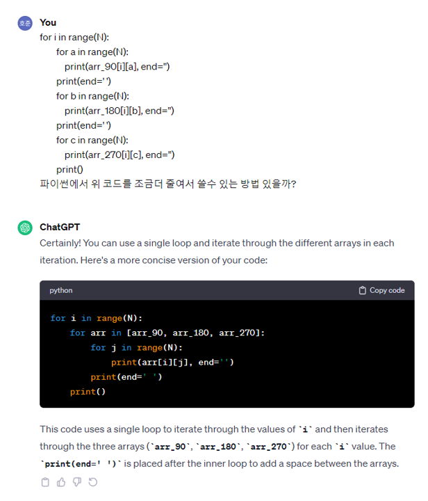

### swea 1961_숫자배열 회전
```python
T = int(input())
for test_case in range(1,T+1):
    N = int(input())
    array = [list(map(int,input().split())) for _ in range(N)]
    arr_90 = [[0 for _ in range(N)] for _ in range(N)]  #90도 회전한 배열 초기화
    arr_180 = [[0 for _ in range(N)] for _ in range(N)]
    arr_270 = [[0 for _ in range(N)] for _ in range(N)]
    
    #array배열 90도회전
    for i in range(N):
        for j in range(N):
            arr_90[i][j] = array[N-1-j][i] #기존 행렬에서 90도 회전

    for i in range(N):
        for j in range(N):
            arr_180[i][j] = arr_90[N-1-j][i] #90도 회전한 행렬에서 90도 회전

    for i in range(N):
        for j in range(N):
            arr_270[i][j] = arr_180[N-1-j][i]

    #정답 출력
    print(f'#{test_case}')
    for a in range(N): #행
        for arr in [arr_90,arr_180,arr_270]: #각 배열
            for b in range(N):  #열
                print(arr[a][b], end='')
            print(end=' ')
        print()
```
