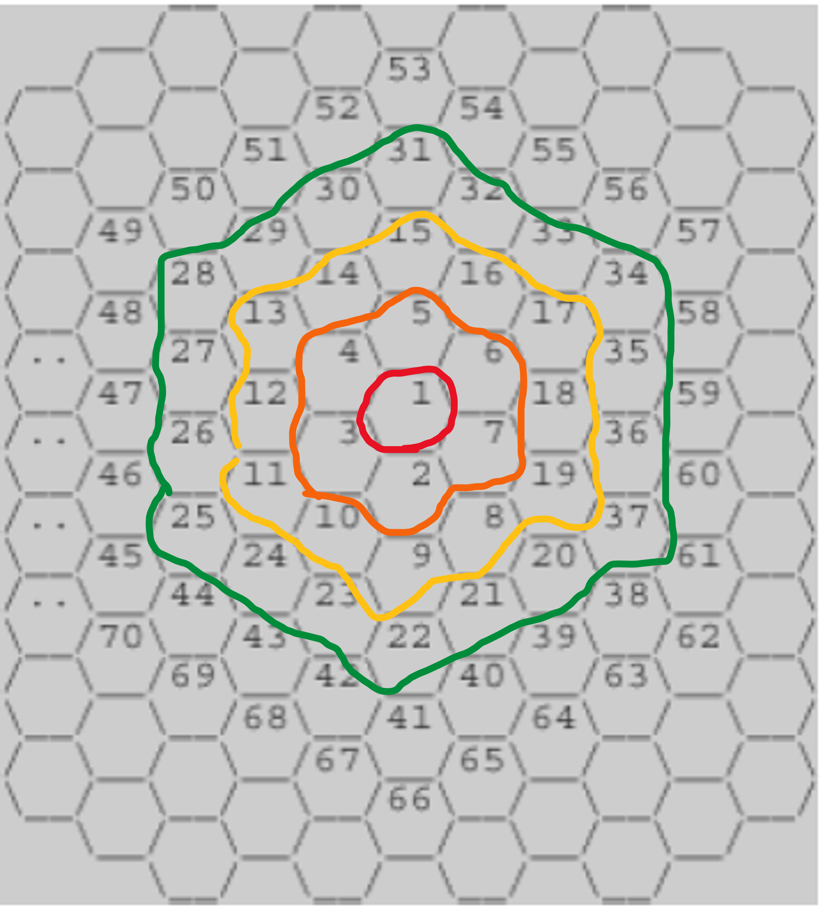

#2292. 벌집
```python
def hive_count(n):
    if n == 1:
        result = 1
    else:
        result = 1 + sum(list(range(n)))*6
    return result

N = int(input())
i = 1
while hive_count(i) < N:
    i = i + 1
print(i)
```
`hive_count(n)`의 값은 
1,     7,      19,          37, ... 이다. 이는 다르게 쓴다면
(1), (1+6), (1+6+6*2), (1+6+6*2+6*3) 이다.
따라서 hive_count(n)은
n==1일때 1이고, 아닐때는
1+6(1+2+3+...+(n-1)) 이다.
이를 코드로 바꾸면
`result = 1 + sum(list(range(n)))*6`가 된다.


