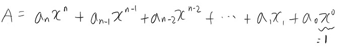

### 2745. 진법변환 

>Q. B진법 수 N이 주어진다. 이 수를 10진법으로 바꿔 출력하는 프로그램을 작성하시오.<br><br>
10진법을 넘어가는 진법은 숫자로 표시할 수 없는 자리가 있다. 이런 경우에는 다음과 같이 알파벳 대문자를 사용한다.<br>
A: 10, B: 11, ..., F: 15, ..., Y: 34, Z: 35  

> (입력)   
>- 첫째 줄에 N과 B가 주어진다. (2 ≤ B ≤ 36)
> - B진법 수 N을 10진법으로 바꾸면, 항상 10억보다 작거나 같다.

>(출력)
> <br>첫째 줄에 B진법 수 N을 10진법으로 출력한다.

#### 예제
```python
ZZZZZ 36
```
```python
60466175
```
---
---

<br><br>

### 학습

#### 진법의 의미

- 진법의 정의 : 위치값 기수법(positional system) 수의 표기법
    - 위치값 기수법 : `숫자의 위치와 계수를 이용`하여 수를 나타내는 방법
    - x진법 : `x를 기준으로 자리 올림`하는 표현법
        - (ex) 2진법 일 경우<br>
        0,1만 표현 → 2가 되면 자리올림

    ```md
    6491
    = 6000+400+90+1
    =6*10^3+4*10^2+9*10+1*10^0
    ```
- 수식정리  
 

---
#### x진법 → 10진법 변환

x 진법 : 각 자리 숫자에 현재 자리 위치만큼 x를 거듭제곱한 수를 모두 더한 값 
=> 10진법   


10진법을 넘는 경우 알파벳으로 표현
A: 10, B: 11, ..., F: 15, ..., Y: 34, Z: 35

<br><br>
---
---

### 풀이

```python
    arr= '0123456789ABCDEFGHIJKLMNOPQRSTUVWXYZ' #계수 위치 설정

    N, B = map(str,input().split()) # N, B 설정 (한 줄로 받기 때문에 map함수 사용)

    total= len(N) #위치 범위 설정
    sum= 0 # 총 더한 값 초기화
    reverse = N[::-1] #역순으로 정렬 
    # 위치 범위 설정
    for a in range(total):
    num = reverse[a] #위치별 계수  
    n = arr.index(num) # 계수 값 

    request = n * (int(B) ** a ) # 계수 * 위치에 따른 지수 곱하기
    sum += request #값을 더함

    print (sum)
```