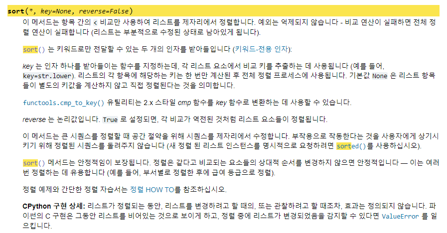

# 7785. 회사에 있는 사람

## 최근 푼 방법
시간 : 228ms
```python
import sys
n = int(sys.stdin.readline())

log_dict = dict()#최신 상황이 담긴 log딕셔너리

for _ in range(n):
    name,log = sys.stdin.readline().split()
    log_dict.update({f'{name}': f'{log}'})#update를 이용해 최신 로그를 업데이트

enter_person_list = []
for key in log_dict:
    if log_dict[key] == 'enter':
        enter_person_list.append(key)

enter_person_list.sort(reverse = True) 
list(map((lambda i : print(enter_person_list[i])),range(len(enter_person_list))))
```

기본 `.sort()`는 오름차순 정렬
`.sort(reverse=True)`는 내림차순 정렬

## 실수했던 부분
```python
for _ in range(n):
    name,log = sys.stdin.readline().split()
    log_dict.update({f'{name}': f'{log}'})
print(log_dict)
"""
{'Baha': 'leave', 'Askar': 'enter', 'Artem': 'enter'}
"""
```

```python
for _ in range(n):
    name,log = sys.stdin.readline().split()
    log_dict.update(name = log)
print(log_dict)
"""
`{'name': 'enter'}`
"""
```
아래 방법 같은 방법을 이용하면 name자체를 변수로 여겨서 원하는 결과가 나오지 않으므로 주의..
