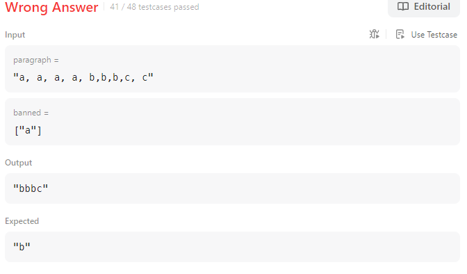

# 4. 가장 흔한 단어 (리트코드 4번)

#### 실패 코드

```python
class Solution:
    def mostCommonWord(self, paragraph: str, banned: List[str]) -> str:
        word_split = paragraph.split() #공백 기준 분리
        word_num = len(word_split) 
        word_dict = {} 
        #단어를 key로 하고 value를 개수로 할 딕셔너리 생성

        for i in range(word_num):
            word =''
            for j in word_split[i]:
                if j.isalpha :
                    if j not in[',', '.', '!', '"', "'", ';']:
                    #특수 문자는 빼고 들어온 문자를 소문자로 변경해서 word의 뒤에 추가
                        word += j.lower()
            if word not in banned: #word가banned에 없는 경우만 
                if word_dict.get(word) == None: 
                    word_dict[word] = 1
                else:
                    word_dict[word] += 1
        
        return max(word_dict, key = word_dict.get)

```
위 경우 테스트 케이스는 모두 통과하였으나 예외가 있었음


`split` 하는 방식을 공백 외에도 [',', '.', '!', '"', "'", ';'] 를 추가 하고 싶었음.

```python
import re

class Solution:
    def mostCommonWord(self, paragraph: str, banned: List[str]) -> str:
        #정규식 사용해서 대괄호 안의 모든 기호로 paragraph를 분리
        word_split = re.split("[,.?!'\"; ]",paragraph) 
        word_num = len(word_split)
        word_dict = {}
        for i in range(word_num):
            word =''
            for j in word_split[i]:
                if j.isalpha :# 숫자가 나오는 경우가 없어서 생략 가능했음.
                    word += j.lower()
            if word not in banned and word !='':
                if word_dict.get(word) == None:
                    word_dict[word] = 1
                else:
                    word_dict[word] += 1

        print(word_dict)
        
        return max(word_dict, key = word_dict.get)

```
#### leetcode solutions에서 방법

```python
import re

class Solution:
    def mostCommonWord(self, paragraph: str, banned: List[str]) -> str:
        a = re.split(r'\W+', paragraph.lower())

        b = [w for w in a if w not in banned]
        print(b)
		"""
        "..Bob hit a ball, the hit BALL flew far after it was hit."
        ['', 'bob', 'a', 'ball', 'the', 'ball', 'flew', 'far', 'after', 'it', 'was', '']
        비알파벳 요소로 시작하거나 끝날때는 ''가 b안에 저장되므로 이를 없에 줘야함
        """
        b = [w for w in b if w!='']

        #b.count 함수가 반환하는 최댓값중 첫번째 요소 반환
        return max(b, key = b.count)
```

```python
a = re.split(r'\W+', paragraph.lower())
```
여기서 `\W`는 비알파벳 문자를 의미함

`+`는 하나 이상의 연속된 비알파벳 문자를 의미함

즉, 문자열을 소문자로 변경 후 비알파벳 문자(문자,숫자,언더스코어 제외한 모든 것)을 기준으로 분할하여 리스트 'a'에 저장한다는 의미 